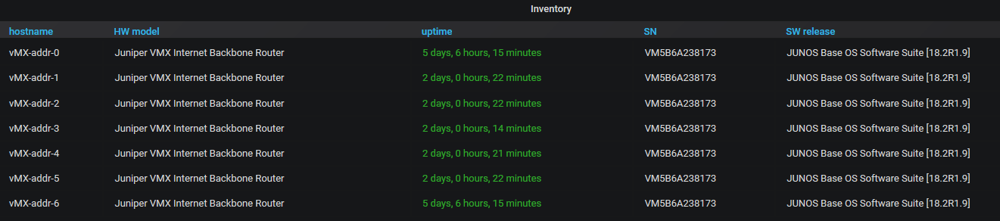
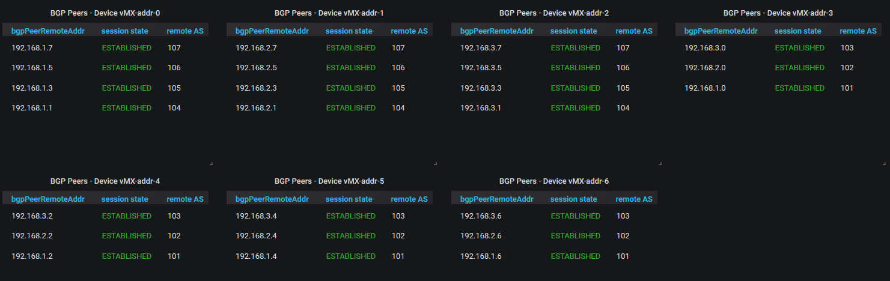
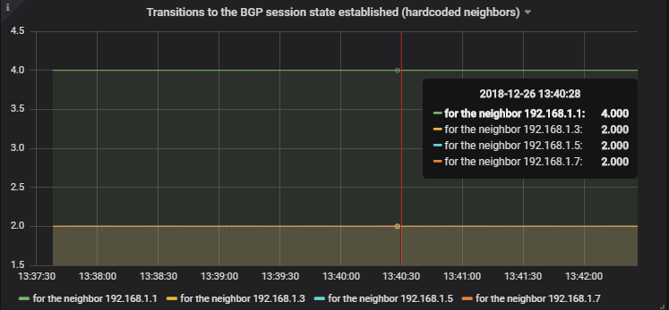
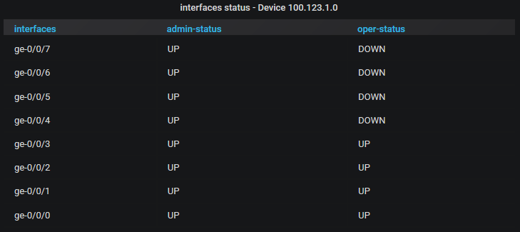

This repository is about monitoring Junos devices using a TIG stack (Telegraf-Influxdb-Grafana).  
It has ready to use content to monitor interfaces and BGP and other details (uptime, SN, HW models, ...).    
It currently supports data collection on Junos using SNMP and OpenConfig.  

Please visit the [**wiki**](https://github.com/ksator/junos_monitoring_with_a_TIG_stack/wiki) for detailled instructions.  

Here are some Grafana screenshots:

  

  

  

  

